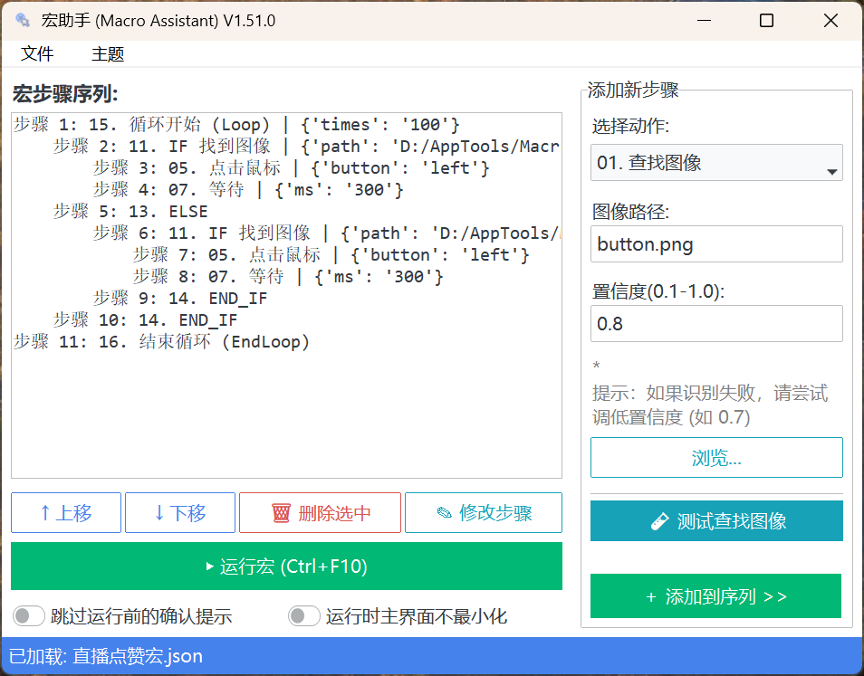

# 智点助手 MacroMate 

%20%7C%203.10--3.12-blue.svg)

## 📖 项目简介

**智点助手（MacroMate）** 是一款开源免费的 Windows 桌面自动化工具。它通过键鼠模拟、图像识别、OCR 文字识别、流程控制和变量系统，把重复的桌面操作整理成可保存、编辑和复用的宏。

无需编程经验即可通过 GUI 创建流程；复杂任务也可以使用 IF/ELSE、循环、标签跳转、变量计算、文件读写、人工输入和逐行批处理。程序同时提供命令行执行模式，便于定时任务或其他工具调用。

当前版本重点增强了运行停止、多屏坐标、搜索范围预览、OCR 位置缓存、图像模板缓存、日志诊断和打包环境兼容性。

  

---

## ⚡ 核心功能

- **🛡️ 即时安全中断**：支持全局停止热键 `Ctrl+F11`、悬浮状态栏停止按钮、PyAutoGUI failsafe，以及 RUN 子进程清理。
- **🔍 图像与文字识别**：支持模板图像查找、OCR 文字定位、识别结果保存到剪贴板或变量，并可用正则表达式提取字段。
- **💼 多引擎 OCR**：集成 WinOCR、RapidOCR、Tesseract，可根据系统环境自动推荐或手动指定。
- **🚀 增强匹配模式**：图像查找可启用多级缩放匹配，OCR 可进行放大识别，提高低分辨率或复杂界面的命中率。
- **🧭 流程控制**：支持 IF/ELSE、普通循环、直到找到图像/文本、标签跳转、条件跳转，并带有最大跳转次数等安全阀。
- **🔗 变量与数据流**：支持设置变量、读取文件、正则提取、JSON 提取、变量计算、人工输入，并通过 `{变量名}` 在后续步骤复用。
- **📦 批量处理**：可从文件或变量中逐行读取账号、编号、订单、表单数据，每行执行一次完整流程。
- **📁 RUN 安全执行**：外部命令、脚本和文件写入默认受开关控制，需在主界面明确启用后才执行。
- **🖥️ 多屏支持**：截图、区域选择、OCR/VLM 坐标映射支持虚拟屏幕、负坐标和上下排列副屏。
- **🧪 调试友好**：步骤可屏蔽/启用，查找图像、查找文本和 AI 定位可在添加步骤前即时测试。

---

## 🚀 快速上手

### 安装依赖

Windows 10/11 推荐使用 Python 3.10 至 3.12：

~~~powershell
python -m pip install -r requirements.txt
~~~

Windows 7 使用 Python 3.8 和专用依赖文件：

~~~powershell
python -m pip install -r requirements_win7.txt
~~~

Windows 7 不支持 WinOCR，建议使用 RapidOCR 或 Tesseract。

### 启动程序

~~~powershell
python MacroMate.py
~~~

也可以直接运行打包后的 **MacroMate.exe**。

### 创建简单宏

例如查找“登录”，点击目标，然后输入账号并确认：

~~~text
11. 查找文本 (OCR): 登录
01. 点击鼠标
06. 输入文本: {account}
07. 按下按键: enter
~~~

### 运行与停止

- 默认启动热键：**Ctrl+F1**
- 默认停止热键：**Ctrl+F2**
- 主窗口运行按钮和悬浮状态栏也可启动或停止
- 鼠标快速移动到屏幕角落可触发 PyAutoGUI failsafe

停止请求会先通过线程安全事件通知执行引擎。若代码正处于 OCR、驱动或其他原生库调用中，可能需要等待该调用返回；程序会保留延迟强制停止作为兜底。

---

## 📚 动作列表

动作编号以当前 v1.8.3 界面顺序为准。

| 序号 | 动作 | 说明 |
|---:|---|---|
| 01 | 点击鼠标 | 在当前或指定坐标点击，支持左右中键、多次点击和毫秒级点击间隔。 |
| 02 | 移动到（绝对坐标） | 将鼠标移动到指定屏幕坐标。 |
| 03 | 相对移动 | 基于当前位置或上次定位结果移动指定偏移量。 |
| 04 | 滚动滚轮 | 在当前位置或指定坐标滚动。 |
| 05 | 等待 | 按毫秒暂停，并持续响应停止请求。 |
| 06 | 输入文本 | 输入固定文本或变量内容；中文和复杂文本通过剪贴板粘贴。 |
| 07 | 按下按键 | 模拟单键或组合键，例如 enter、ctrl+c。 |
| 08 | 激活窗口（按标题） | 按标题查找并激活窗口，可配置失败处理。 |
| 09 | 备注 | 添加说明；以 LABEL: 或 标签: 开头时可定义跳转标签。 |
| 10 | 查找图像 | 在全屏或指定区域查找模板，并定位到目标中心。 |
| 11 | 查找文本（OCR） | 定位文字，可保存识别原文并用正则提取字段。 |
| 12 | IF 找到图像 | 找到模板时执行 IF 块。 |
| 13 | IF 找到文本 | 找到目标文字时执行 IF 块。 |
| 14 | IF 变量比较 | 按文本或数值条件执行分支。 |
| 15 | ELSE | IF 条件不成立时执行。 |
| 16 | END_IF | 结束 IF/ELSE 块。 |
| 17 | 循环开始 | 固定次数循环，或直到找到图像/文字。 |
| 18 | 结束循环 | 结束普通循环。 |
| 19 | 设置变量 | 创建或更新运行变量。 |
| 20 | 变量计算 | 使用安全表达式进行基础数值计算。 |
| 21 | 正则提取变量 | 从文本中提取匹配内容并保存。 |
| 22 | 人工输入 | 暂停宏并弹出输入框，将结果保存为变量。 |
| 23 | 跳转到标签 | 跳转到备注步骤定义的标签。 |
| 24 | 条件跳转 | 条件成立时跳转到指定标签。 |
| 25 | 读取文本文件到变量 | 从允许的路径读取文本。 |
| 26 | 写入文本文件 | 覆盖或追加文本到允许的路径。 |
| 27 | 批量处理文本行 | 从文本或文件逐行读取数据。 |
| 28 | 结束批量处理 | 结束逐行处理块。 |
| 29 | 执行命令/脚本 | 在明确授权后执行外部命令或脚本。 |
| 30 | AI 自然语言指令 | 使用 VLM 分析截图并定位目标坐标。 |

---

## 💡 变量与流程控制

### 变量

运行中产生的值可以保存为变量，后续通过 **{变量名}** 使用。变量可来自 OCR、设置变量、正则提取、文件读取、人工输入、变量计算和批量处理字段。

~~~text
19. 设置变量
变量名: account
变量值: demo_user

06. 输入文本
文本: 当前账号是 {account}
~~~

### IF 变量比较与安全计算

支持 **==、!=、>、<、>=、<=、包含、不包含**。数值比较优先使用精确整数或 Decimal，避免大订单号或高精度数值被浮点转换后破坏。

~~~text
14. IF 变量比较
比较左侧: {price}
操作符: >
比较右侧: 100

20. 变量计算
表达式: ({price} + {shipping}) * 0.8
保存至变量: final_price
~~~

变量计算不使用 eval，仅支持数字、括号以及 +、-、*、/、//、% 运算，不支持函数调用、文件访问或系统命令。

### 标签与跳转

标签由备注步骤定义：

~~~text
09. 备注
内容: LABEL: 重试登录

23. 跳转到标签
目标标签: 重试登录
最大跳转次数: 100
~~~

- 标签名必须唯一。
- 找不到标签或出现重复标签会在运行前报错。
- 普通 LOOP 和批量处理块内部禁止执行 GOTO。
- 最大跳转次数用于防止失控循环。

条件跳转相当于一行版 IF + GOTO：

~~~text
24. 条件跳转
比较左侧: {stock}
操作符: ==
比较右侧: 0
跳转标签: 缺货处理
~~~

### 人工输入

人工输入由 MacroMate 自己弹出输入框，适合验证码或半自动确认。

~~~text
22. 人工输入
询问内容: 请输入验证码
保存至变量: code
~~~

取消人工输入会安全停止宏。

### 批量处理文本行

~~~text
27. 批量处理文本行
数据文件: D:\accounts.txt
当前行变量: current_line
分隔符: ,
字段变量: account,password

06. 输入文本: {account}
07. 按下按键: tab
06. 输入文本: {password}
07. 按下按键: enter
28. 结束批量处理
~~~

每轮可使用 **{current_line}、{loop_index}、{loop_total}** 以及拆分出的字段变量。默认跳过空行，默认最大处理 10000 行。普通循环和批量处理不能互相嵌套。

---

## 🔎 图像、OCR 与搜索范围

### 搜索范围

图像、OCR、条件查找、循环条件和 AI 指令都可填写：

~~~text
x1, y1, x2, y2
~~~

留空表示全屏。点击“框选”可重新选择区域；点击“预览”会直接在当前桌面显示红色边框，并分别在左上角和右下角显示坐标，不会遮盖桌面内容。

### OCR 引擎

- **WinOCR**：适用于 Windows 10/11，启动快。
- **RapidOCR**：基于 ONNX Runtime，适合中文和复杂界面。
- **Tesseract**：本地离线兜底，需要正确安装语言包。
- **自动选择**：根据可用引擎和近期成功结果安排尝试顺序。

RapidOCR 的依赖类会在模块加载阶段导入。不要将它改成首次 OCR 时再导入，否则部分 Windows 或打包环境可能出现 ONNX Runtime DLL 初始化失败。

### OCR 位置缓存

OCR 成功后会在内存中记录目标位置和成功引擎。再次执行相同宏步骤时先截取上次位置附近的小区域复核；失败后扩大区域，仍失败则回退到全屏或指定范围搜索并更新缓存。

缓存只存在于当前进程内，不写入宏文件。屏幕内容变化后不会盲目复用旧坐标。

### 图像模板缓存

图像模板按文件路径、修改时间和大小缓存，并设置内存上限。替换模板文件后会重新加载，避免继续使用旧图像数据。

---

## 🤖 VLM / AI 指令

AI 自然语言指令会把截图发送给配置的 VLM，并解析返回坐标。当前适配 OpenAI 兼容接口、Anthropic、智谱、通义千问、阶跃星辰和 OpenRouter 等提供商。

使用前在“设置 → AI 大模型配置”中填写提供商、API Key、模型名称（可选）和超时时间。

- API Key 保存在本地 **macro_settings.json**，不要分享该文件。
- 截图可能包含敏感信息，使用在线模型前请确认数据边界。
- 不支持视觉的模型不能用于截图定位。
- VLM 日志会限制原始响应和错误正文的输出。

---

## 🔐 RUN 与文件安全

**执行命令/脚本** 默认禁用，必须在 GUI 中明确打开 RUN 开关；CLI 模式必须添加 **--enable-run**。

- 只运行来源可信的命令和脚本。
- shell_mode 默认拒绝，不能由普通宏静默开启。
- 脚本解释器仅允许 python、python3、node、powershell、cmd、bat。
- 脚本、文件读写和批处理默认限制在宏目录、当前工作目录或程序目录。
- 路径穿越和越界路径会被拒绝。
- 停止宏或关闭程序时会清理已登记的外部子进程。

**写入文本文件** 是独立动作，不受 RUN 开关控制，但仍受路径边界、允许扩展名和错误处理规则保护。

---

## ⌨️ 命令行模式

~~~powershell
python MacroMate.py demo.json
python MacroMate.py --run demo.json
python MacroMate.py demo.json --enable-run
~~~

其他参数：

~~~text
--theme THEME                 GUI 初始主题
--log-encoding utf-8|gbk      控制台日志编码
-h, --help                    显示帮助
~~~

CLI 支持 GUI 保存的 {"steps": [...]} 格式，也兼容直接保存的步骤列表。未指定脚本时启动 GUI。

---

## 🖥️ 多屏、DPI 与截图

当前截图底层统一使用物理虚拟屏幕坐标，支持负坐标、上下排列副屏、跨屏框选与预览，以及 OCR、图像和 VLM 坐标偏移还原。

锁屏、远程桌面断开、无显示器虚拟机等环境可能无法截图。程序会报告截图不可用，而不会把失败误判为查找成功。

---

## 🧪 调试、测试与打包

建议先单独测试图像、OCR 或 AI 定位，再预览搜索范围，之后加入点击、输入、IF、循环、文件和 RUN。

开发者可运行完整 Beta 预检：

~~~powershell
python .\Beta\run_preflight_tests.py
~~~

预检包括编译、编码扫描、单元测试、CLI、GUI、配置保存、样例宏和动作矩阵。目前测试集包含 221 项测试，另有 1 项按环境条件跳过。

打包前建议清理旧缓存：

~~~powershell
Remove-Item .\build, .\dist, .\__pycache__ -Recurse -Force -ErrorAction SilentlyContinue
pyinstaller --clean .\MacroMate.spec
~~~

旧 build 或 __pycache__ 可能让 PyInstaller 误用过期模块。

---

## ⚠️ 注意事项

- 自动化会真实控制鼠标和键盘，请先在安全环境测试。
- OCR 和图像识别受字体、主题、缩放、分辨率和截图质量影响。
- 长时间原生 OCR/DLL 调用可能无法在请求停止的瞬间退出。
- GOTO、循环和批量处理均有安全限制，请避免无穷流程。
- 启用 RUN 或在线 VLM 前确认命令、脚本和数据来源可信。

---

## 📄 许可

本项目基于 MIT License 开源。

